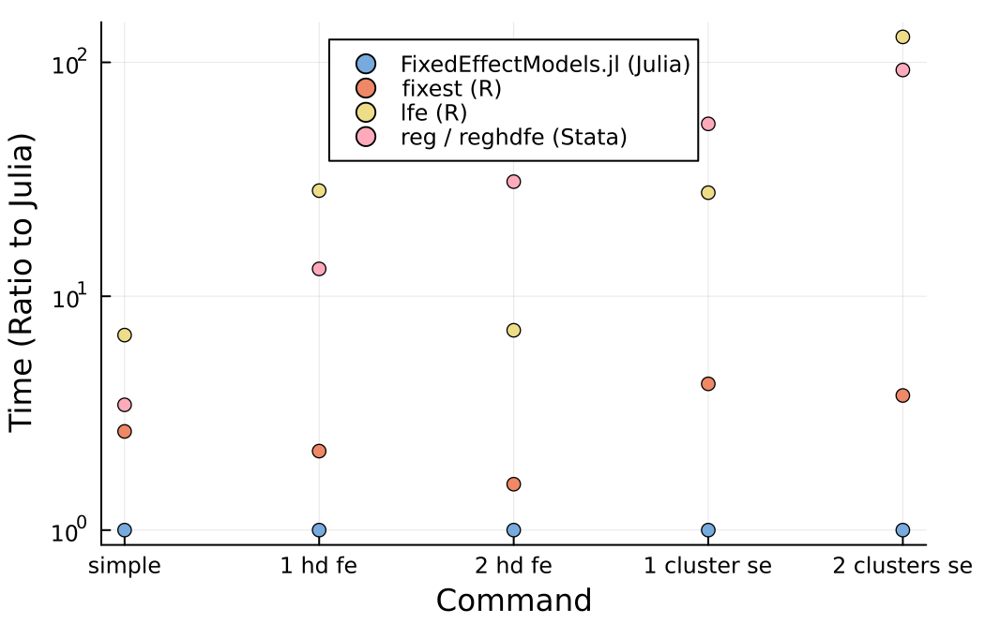

### Simple benchmark 


All timings below are from the same machine (Apple M4, 16GB RAM, 2026-08-28).
Code to reproduce this graph:

  FixedEffectModels.jl v2.1.0 (Julia 1.12.7, started with `julia -t auto`; timings are warm calls)
  ```julia
  using DataFrames, CategoricalArrays, FixedEffectModels
  N = 10_000_000
  K = 100
  id1 = rand(1:(N/K), N)
  id2 = rand(1:K, N)
  x1 =  randn(N)
  x2 =  randn(N)
  y= 3 .* x1 .+ 2 .* x2 .+ sin.(id1) .+ cos.(id2).^2 .+ randn(N)
  df = DataFrame(id1 = categorical(id1), id2 = categorical(id2), x1 = x1, x2 = x2, y = y)
  @time reg(df, @formula(y ~ x1 + x2))
  # 0.133884 seconds (313 allocations: 386.310 MiB, 1.42% gc time)
  @time reg(df, @formula(y ~ x1 + x2 + fe(id1)))
  # 0.203769 seconds (2.75 k allocations: 664.707 MiB, 28.83% gc time)
  @time reg(df, @formula(y ~ x1 + x2 + fe(id1) + fe(id2)))
  # 0.489542 seconds (7.22 k allocations: 893.853 MiB, 17.39% gc time)
  @time reg(df, @formula(y ~ x1 + x2), Vcov.cluster(:id1))
  # 0.117933 seconds (468 allocations: 535.131 MiB, 0.43% gc time)
  @time reg(df, @formula(y ~ x1 + x2), Vcov.cluster(:id1, :id2))
  # 0.384734 seconds (641 allocations: 849.876 MiB, 13.68% gc time)
  ````


  fixest v0.13.2 (R 4.4.2)
  ```R
  library(fixest)
  N = 10000000
  K = 100
  df = data.frame(
    id1 =  as.factor(sample(N/K, N, replace = TRUE)),
    id2 =  as.factor(sample(K, N, replace = TRUE)),
    x1 =  runif(N),
    x2 =  runif(N)
  )
  df[, "y"] =  3 * df[, "x1"] + 2 * df[, "x2"] + sin(as.numeric(df[, "id1"])) + cos(as.numeric(df[, "id2"])) + runif(N)
  system.time(feols(y ~ x1 + x2, df))
  #>      user  system elapsed 
  #>     0.324   0.028   0.354 
  system.time(feols(y ~ x1 + x2|id1, df))
  #>    user  system elapsed 
  #>   0.396   0.048   0.444 
  system.time(feols(y ~ x1 + x2|id1 + id2, df))
  #>  user  system elapsed 
  #>   0.714   0.056   0.770 
  system.time(feols(y ~ x1 + x2, cluster = "id1", df))
  #> user  system elapsed 
  #>  0.438   0.046   0.498 
  system.time(feols(y ~ x1 + x2, cluster = c("id1", "id2"), df)) 
  #>  user  system elapsed 
  #>  1.345   0.102   1.449 
  ```


  lfe v3.1.1 (R 4.4.2)
  ```R
  library(lfe)
  N = 10000000
  K = 100
  df = data.frame(
    id1 =  as.factor(sample(N/K, N, replace = TRUE)),
    id2 =  as.factor(sample(K, N, replace = TRUE)),
    x1 =  runif(N),
    x2 =  runif(N)
  )
  df[, "y"] =  3 * df[, "x1"] + 2 * df[, "x2"] + sin(as.numeric(df[, "id1"])) + cos(as.numeric(df[, "id2"])) + runif(N)

  system.time(felm(y ~ x1 + x2, df))
  #>   user  system elapsed
  #>   0.807   0.107   0.914 
  system.time(felm(y ~ x1 + x2|id1, df))
  #>    user  system elapsed 
  #>   5.589   0.202   5.770 
  system.time(felm(y ~ x1 + x2|id1 + id2, df))
  #>  user  system elapsed 
  #>  3.580   0.300   3.504 
  system.time(felm(y ~ x1 + x2|0|0|id1, df))
  #> user  system elapsed 
  #>  3.105   0.166   3.271 
  system.time(felm(y ~ x1 + x2|0|0|id1 + id2, df)) 
  #>  user  system elapsed 
  #> 48.771   0.552  49.466 
  ```


  reghdfe 5.7.3 / ivreg2 4.1.11 (Stata 19.0 MP, 2 cores)
  ```
  clear all
  local N = 10000000
  local K = 100
  set obs `N'
  gen  id1 =  floor(runiform() * (`N'+1)/`K')
  gen  id2 =  floor(runiform() * (`K'+1))
  gen   x1 =  runiform()
  gen   x2 =  runiform()
  gen   y =  3 * x1 + 2 * x2 + sin(id1) + cos(id2) + runiform()
  timer clear

  set rmsg on
  reg y x1 x2
  #> r; t=0.46
  reghdfe y x1 x2, a(id1)
  #> r; t=2.67
  reghdfe y x1 x2, a(id1 id2)
  #> r; t=15.14
  reg y x1 x2, cl(id1)
  #> r; t=6.44
  ivreg2 y x1 x2, cluster(id1 id2)
  #> r; t=35.71
  ````
